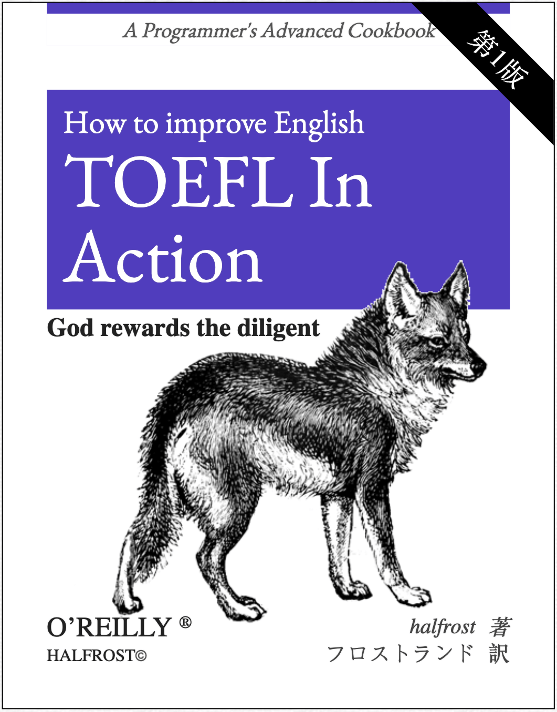

# TOEFL-In-Action

## 感谢

作者的时间和语言技能均有限。因此如果读者在阅读本书的过程中发现任何错误或可提升的语言表述，欢迎您提交 [Issues](https://github.com/halfrost/TOEFL-In-Action/issues/new) 或 [Pull request](https://github.com/halfrost/TOEFL-In-Action/pulls)，
其具体细节请参考[如何参与贡献](./CONTRIBUTING.md)。
如果您想要关注本仓库的更新情况，可以点击仓库的 `Watch`。如果您喜欢本书，我也非常高兴能够收到您的 `Star`。

## 转载声明

转载本指南，请注明作者与 GitHub 链接，谢谢！

## 有疑问或建议

您可以直接提 issue

## 关于赞赏

## 协议/License

 本作品采用<a rel="license" href="http://creativecommons.org/licenses/by-nc/4.0/">知识共享署名-非商业性使用 4.0 国际许可协议</a>进行许可。